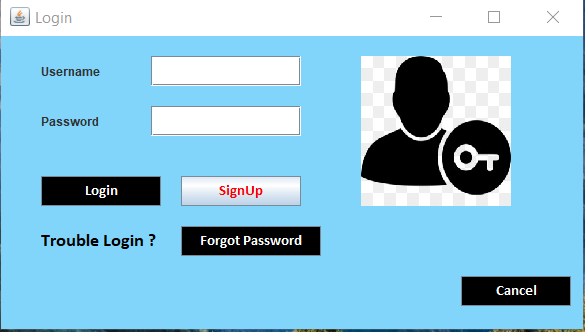
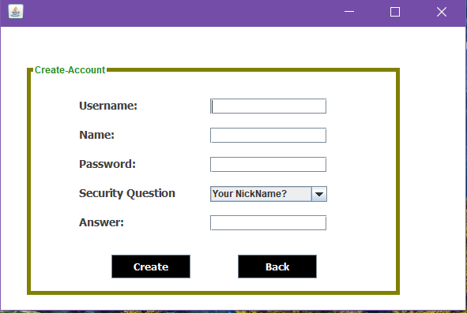
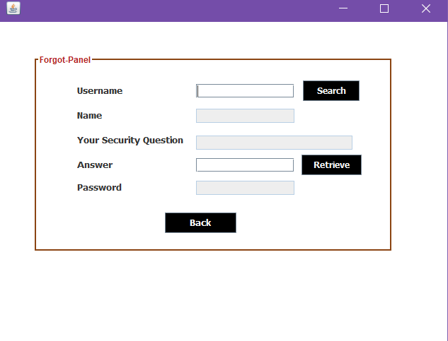
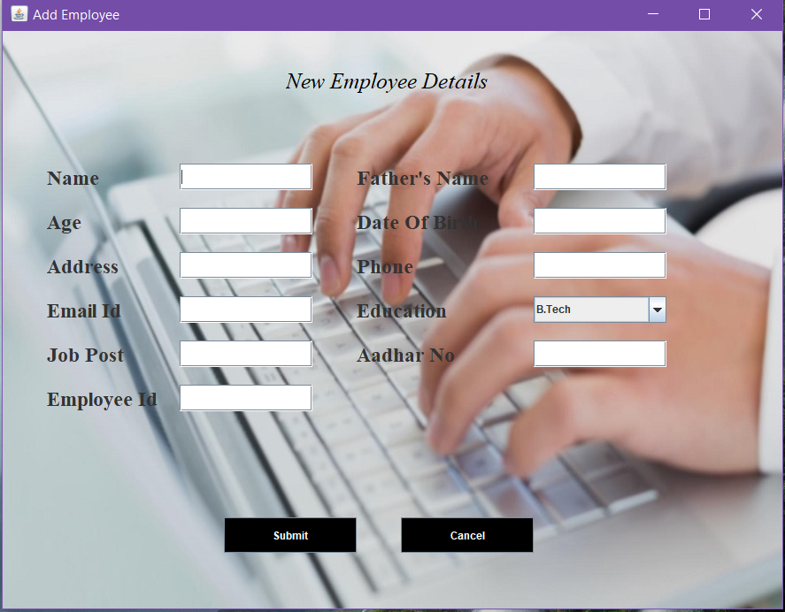
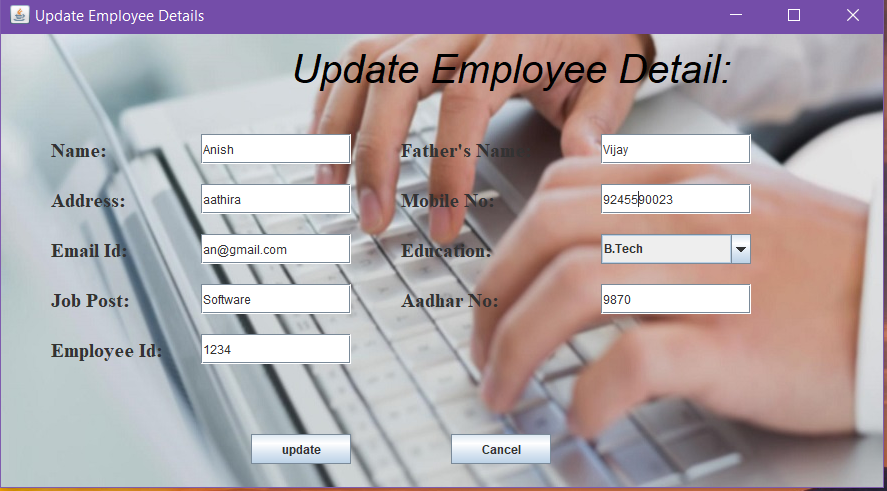
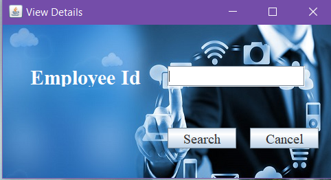
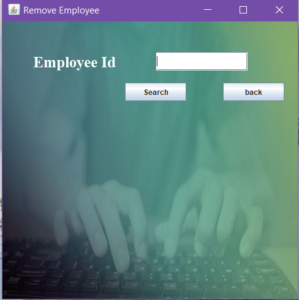

# JavaSwing-EmployeeManagementSystem
Employee Management System

## Front Page

## Login Page

## Sign Up

## Forgot Password

## Details

## Add Employee

## Update Employee

## Search Employee

## View Employee

## Remove Employee

