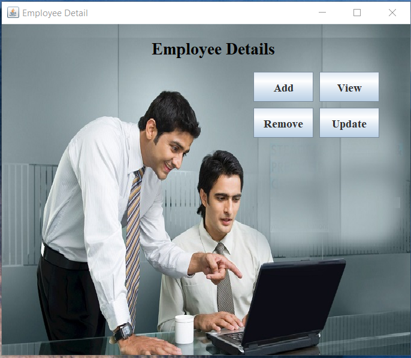

# JavaSwing-EmployeeManagementSystem
# Employee Management System
This Employee Management System Project application stores all the employee’s information in a database. It is an application developed in Java GUI technology and database used is MySQL. It contains employee information like employee id, first name, surname, and age. It is an easy to use application and has a user-friendly interface.In this user can add, modify, search and remove the employee details.

## Front Page

## Login Page

## Sign Up

## Forgot Password

## Details

## Add Employee

## Update Employee

## Search Employee

## View Employee

## Remove Employee

